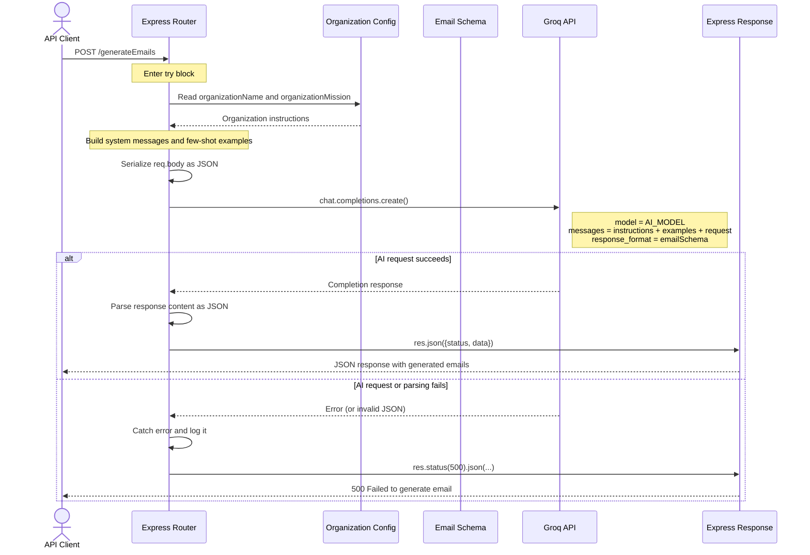

```mermaid
sequenceDiagram
    actor User as API Client
    participant Router as Express Router
    participant Config as Organization Config
    participant Schema as Email Schema
    participant Groq as Groq API
    participant Server as Express Response

    User->>Router: POST /generateEmails
    Note over Router: Enter try block

    Router->>Config: Read organizationName and organizationMission
    Config-->>Router: Organization instructions

    Note over Router: Build system messages and few-shot examples
    Router->>Router: Serialize req.body as JSON

    Router->>Groq: chat.completions.create()
    Note right of Groq: model = AI_MODEL<br/>messages = instructions + examples + request<br/>response_format = emailSchema

    alt AI request succeeds
        Groq-->>Router: Completion response
        Router->>Router: Parse response content as JSON
        Router->>Server: res.json({status, data})
        Server-->>User: JSON response with generated emails
    else AI request or parsing fails
        Groq-->>Router: Error (or invalid JSON)
        Router->>Router: Catch error and log it
        Router->>Server: res.status(500).json(...)
        Server-->>User: 500 Failed to generate email
    end
```
