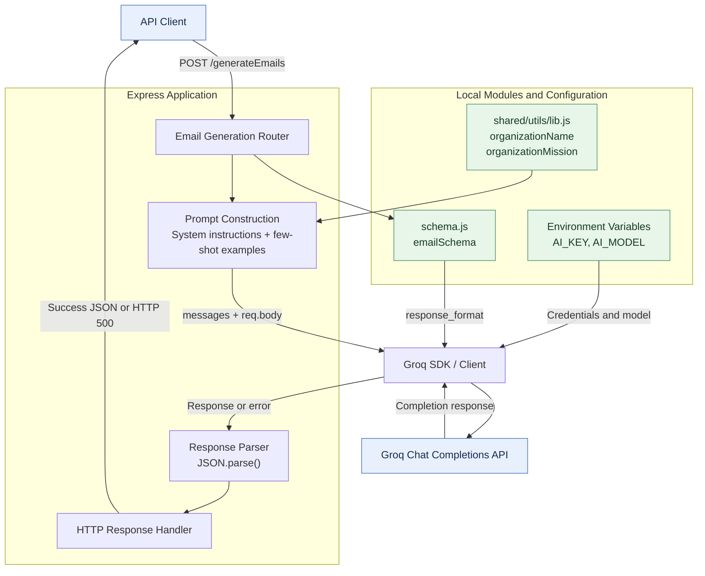

```mermaid

flowchart TB
    Client["API Client"]

    subgraph App["Express Application"]
        Router["Email Generation Router"]
        Prompt["Prompt Construction<br/>System instructions + few-shot examples"]
        Parser["Response Parser<br/>JSON.parse()"]
        Handler["HTTP Response Handler"]
    end

    subgraph Local["Local Modules and Configuration"]
        Utils["shared/utils/lib.js<br/>organizationName<br/>organizationMission"]
        Schema["schema.js<br/>emailSchema"]
        Env["Environment Variables<br/>AI_KEY, AI_MODEL"]
    end

    Groq["Groq SDK / Client"]
    API["Groq Chat Completions API"]

    Client -->|"POST /generateEmails"| Router
    Router --> Prompt
    Utils --> Prompt
    Router --> Schema
    Env -->|"Credentials and model"| Groq
    Prompt -->|"messages + req.body"| Groq
    Schema -->|"response_format"| Groq
    Groq --> API
    API -->|"Completion response"| Groq
    Groq -->|"Response or error"| Parser
    Parser --> Handler
    Handler -->|"Success JSON or HTTP 500"| Client

    classDef external fill:#e8f0fe,stroke:#4778bd,color:#172b4d
    classDef local fill:#e8f5e9,stroke:#4c956c,color:#173b25
    class Client,API external
    class Utils,Schema,Env local

```
